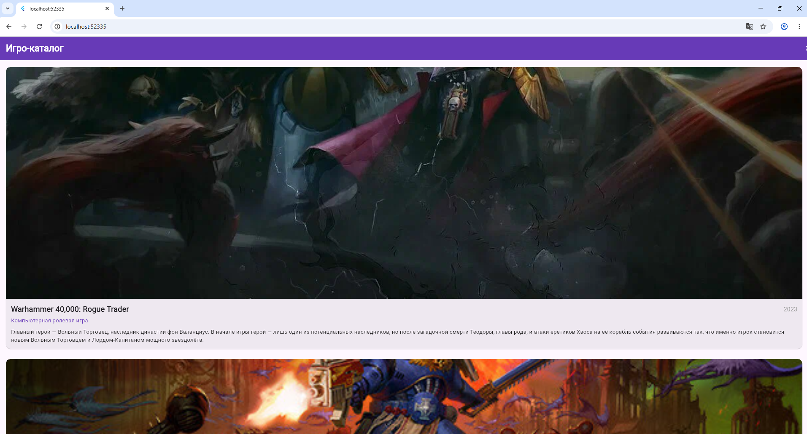

# Лабораторная работа №4. Flutter: списки, модели данных и карточки

**Фамилия, имя:** _[Тимонин И.В]_  
**Группа:** _[ИСП-233]_  
**Дата сдачи:** _[09.05.2026]_

---

## Чему научились

- Создавать **модели данных** в Dart — классы, которые описывают структуру сложных объектов.
- Использовать **ListView.builder** для эффективного отображения длинных прокручиваемых списков (виджеты создаются только для видимых элементов — аналог RecyclerView в Android).
- Подключать **локальные assets** (изображения) и управлять ими через pubspec.yaml, указывая целую папку.

---

## Скриншот финального приложения



---

## Инструкция по запуску

1. Убедитесь, что у вас установлен Flutter SDK (команда `flutter doctor` не показывает критических ошибок).
2. Клонируйте репозиторий:
   ```bash
   git clone <URL_вашего_репозитория>
   cd Flutter_Lab4
   ```
3. Установите зависимости:
   ```bash
   flutter pub get
   ```
4. Запустите приложение в браузере Chrome
   ```bash
   flutter run -d chrome
   ```
